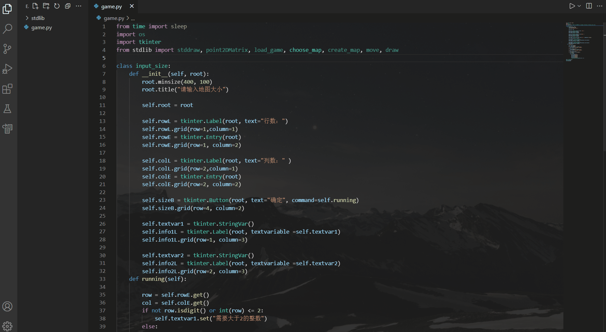
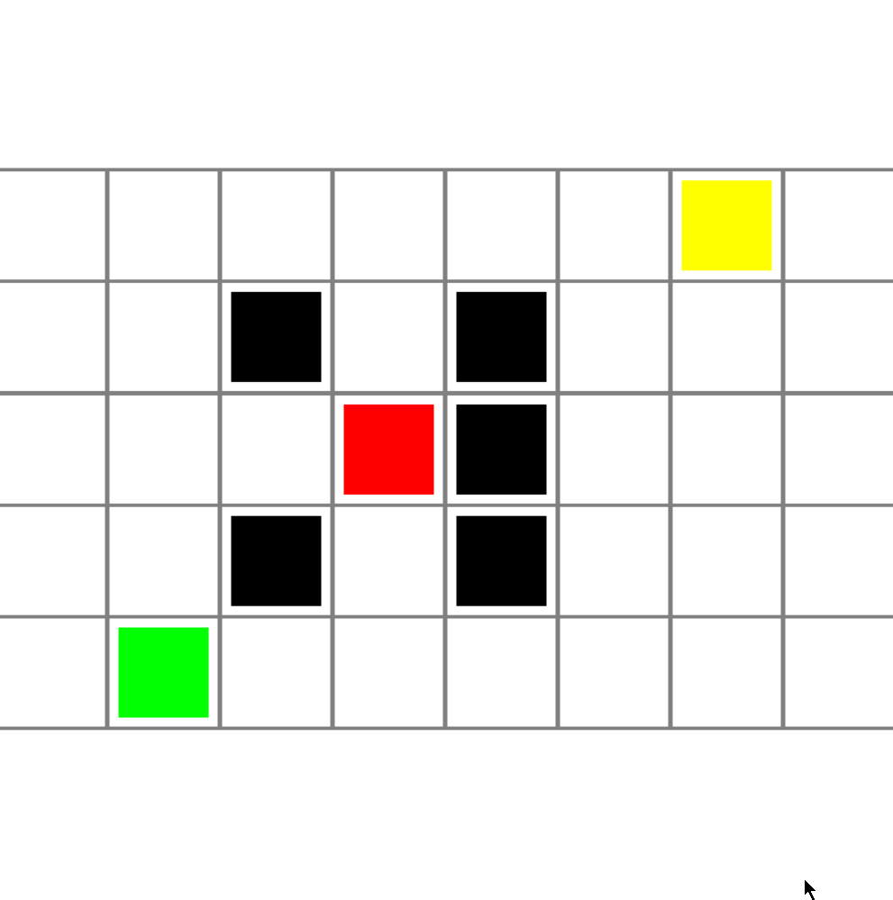

# Sokoban
A simple push box game

1. 运行game.py即可开始游戏
2. 输入行数和列数（必须是大于2的数字，其他输入不能通过）
3. 显示当前存在的关卡，输入框输入关卡名。加载关卡只能加载已存在的关卡，创建关卡会覆盖或新建一个关卡。
4. 创建关卡时，点击对应方格创建一面"墙"。按下S键后，再依次创建人物（黄色）、箱子（红色）、终点（绿色）
5. 加载关卡立即、创建关卡在创建关卡完毕后，按A、D、S、W即可左右下上移动人物。将箱子推至终点获胜

添加了自动寻路的功能，按m键即能自动寻路